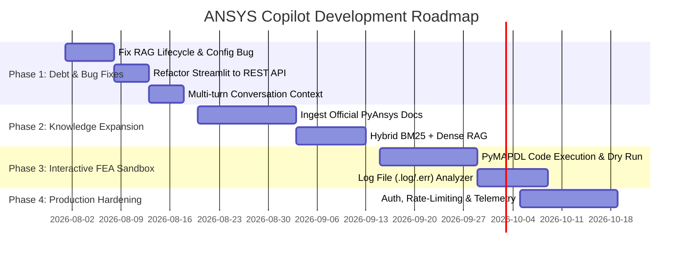

# 📊 ANSYS Copilot: Comprehensive Project Analysis & Strategic Roadmap

> **Report Prepared:** July 26, 2026  
> **Repository:** `moniishhh/ansys-copilot`  
> **Domain:** Engineering Simulation Assistance (FEA/CFD) via AI & RAG

---

## 1. Project Overview & Identity

**ANSYS Copilot** is a specialized AI assistant designed to streamline simulation engineering workflows for ANSYS software users (specifically ANSYS MAPDL / PyMAPDL). It aims to reduce script writing time, troubleshoot complex non-linear solver convergence issues, suggest optimal meshing parameters, and answer technical questions using domain-specific knowledge retrieval.

### Tech Stack Summary
- **Frontend:** Streamlit (`frontend/streamlit_app.py`)
- **Backend:** FastAPI (`backend/main.py`), Uvicorn, Pydantic v2 / `pydantic-settings`
- **LLM Integration:** LangChain, `langchain-google-genai` (Google Gemini `gemini-2.5-flash`)
- **RAG Engine & Vector DB:** LangChain LCEL, HuggingFace Embeddings (`all-MiniLM-L6-v2`), ChromaDB (`chroma_db/`)
- **Testing:** `pytest`, `httpx` / FastAPI `TestClient`

---

## 2. Architecture & System Design

```
                                  ┌────────────────────────────────┐
                                  │       Streamlit UI             │
                                  │   (General Q&A, APDL, PyMAPDL, │
                                  │         Troubleshoot)          │
                                  └───────────────┬────────────────┘
                                                  │
                                       Direct Import / HTTP API
                                                  │
                                  ┌───────────────▼────────────────┐
                                  │        FastAPI Backend         │
                                  │  /chat │ /generate-script │    │
                                  │         /troubleshoot          │
                                  └───────────────┬────────────────┘
                                                  │
                  ┌───────────────────────────────┼───────────────────────────────┐
                  │                               │                               │
       ┌──────────▼──────────┐         ┌──────────▼──────────┐         ┌──────────▼──────────┐
       │     RAGEngine       │         │    CodeGenerator    │         │    Troubleshooter   │
       │ (LangChain + LCEL)  │         │   (APDL / PyMAPDL)  │         │(Convergence / Mesh) │
       └──────────┬──────────┘         └─────────────────────┘         └─────────────────────┘
                  │
       ┌──────────▼──────────┐
       │      ChromaDB       │
       │ (ANSYS KB Chunks)   │
       └─────────────────────┘
```

### Key Subsystems
1. **RAG Engine (`backend/services/rag_engine.py`)**: Uses modern LangChain Expression Language (LCEL) to chain ChromaDB vector retrieval with Google Gemini for contextual Q&A.
2. **Code Generator (`backend/services/code_generator.py`)**: Generates ANSYS Parametric Design Language (APDL) or PyMAPDL (Python) code snippets along with natural language explanations.
3. **Troubleshooter (`backend/services/troubleshooter.py`)**: Evaluates simulation failure descriptions, distinguishes between mesh quality vs solver convergence issues, and parses structured diagnosis/solutions.
4. **Knowledge Base Scripts (`scripts/`)**: Includes scraping, chunking, synthetic starter data generation, and vector DB indexing pipelines.

---

## 3. Current Project Status

| Component | Status | Details |
| :--- | :--- | :--- |
| **FastAPI REST API** | 🟢 Functional | Endpoints `/chat`, `/generate-script`, `/troubleshoot`, `/health` operational |
| **Streamlit Web UI** | 🟢 Functional | Sidebar mode selection, code display, chat interface |
| **RAG Pipeline** | 🟡 Partial | Works with synthetic starter data; relies on local HuggingFace embeddings |
| **Knowledge Base** | 🟡 Starter Set | Contains synthetic starter data (`starter_knowledge.json`); official docs scraper in progress |
| **Unit Test Suite** | 🟢 Functional | Tests cover routers, services, and markdown parsing with mocks |
| **PyMAPDL Integration**| 🔴 Not Connected | Code is generated but cannot be directly dry-run or executed in ANSYS |

---

## 4. Technical Debt & Bug Analysis

### 🐛 Critical Bugs & Defects

#### 1. Severe Latency Defect in `/chat` Router
- **Issue:** In [`backend/routers/chat.py`](file:///C:/Users/joybo/ansys-copilot/backend/routers/chat.py#L36-L37), every incoming HTTP POST request instantiates a new `RAGEngine()`, forcing ChromaDB and the HuggingFace embedding model (`all-MiniLM-L6-v2`) to reload from disk on **every single request**.
- **Impact:** Massive response latency (3–10+ seconds per query).
- **Fix:** Inject the global `rag_engine` initialized during FastAPI app lifespan ([`backend/main.py`](file:///C:/Users/joybo/ansys-copilot/backend/main.py#L18-L20)) into the router endpoint via FastAPI dependency injection (`Depends`).

#### 2. Configuration & Attribute Error in Knowledge Base Embeddings
- **Issue:** In [`backend/knowledge_base/embeddings.py`](file:///C:/Users/joybo/ansys-copilot/backend/knowledge_base/embeddings.py#L26), the code references `settings.openai_api_key` and `OpenAIEmbeddings`. However, [`backend/config.py`](file:///C:/Users/joybo/ansys-copilot/backend/config.py#L12) only defines `gemini_api_key`.
- **Impact:** Running `create_embeddings()` or `query_similar()` from `embeddings.py` raises an `AttributeError`.
- **Fix:** Refactor `embeddings.py` to use `HuggingFaceEmbeddings(model_name=settings.embedding_model)` consistent with `RAGEngine`.

#### 3. Inconsistent Vector Database Builders (FAISS vs. ChromaDB)
- **Issue:** [`scripts/build_starter_vectordb.py`](file:///C:/Users/joybo/ansys-copilot/scripts/build_starter_vectordb.py#L38) generates a FAISS index in `backend/knowledge_base/faiss_index`. However, `RAGEngine` in `backend/services/rag_engine.py` queries ChromaDB in `./chroma_db`.
- **Impact:** Running `build_starter_vectordb.py` creates an unused FAISS index that is completely ignored by the main application.
- **Fix:** Standardize `scripts/build_starter_vectordb.py` to populate ChromaDB.

#### 4. Streamlit UI Architecture Violation
- **Issue:** [`frontend/streamlit_app.py`](file:///C:/Users/joybo/ansys-copilot/frontend/streamlit_app.py#L14-L16) directly imports backend service classes (`RAGEngine`, `CodeGenerator`, `Troubleshooter`) rather than calling the FastAPI backend via HTTP (`httpx`/`requests`).
- **Impact:** Violates client-server separation, prevents standard deployment of UI and API as separate microservices/containers, and duplicates model instantiation logic.
- **Fix:** Update Streamlit to issue HTTP requests to `http://localhost:8000/chat`, `/generate-script`, and `/troubleshoot`.

#### 5. Ignored Conversation History
- **Issue:** `ChatRequest` schema accepts `conversation_history: list[dict] = []`, but `RAGEngine.query()` accepts only `question: str`.
- **Impact:** Multi-turn chat context is discarded; the bot treats every question as isolated.
- **Fix:** Integrate LangChain message history or format prior context into the RAG prompt template.

#### 6. Fragile LLM Markdown & Section Parsing
- **Issue:** `CodeGenerator._split_code_explanation()` assumes a single markdown fence split (`raw.split("```")`), and `Troubleshooter._parse_response()` relies on exact bold header strings (`**Diagnosis**`).
- **Impact:** Non-standard LLM responses cause missing explanations or unparsed diagnostic lists.
- **Fix:** Use structured output parsers (Pydantic output parsers or JsonOutputParser).

---

## 5. Future Scope & Strategic Recommendations



### Strategic Action Items

1. **Phase 1 — Core Stabilizing (Immediate)**
   - **Lifespan Dependency Injection:** Provide `rag_engine` via FastAPI dependency.
   - **Config Harmonization:** Fix `embeddings.py` to match `config.py`.
   - **REST Client Integration:** Refactor Streamlit to call FastAPI via HTTP.
   - **Robust Parsing:** Implement Pydantic structured output parsing for Gemini.

2. **Phase 2 — Knowledge & Retrieval Enhancements**
   - Ingest official ANSYS APDL Command Reference and PyAnsys documentation (`ansys-mapdl-core`, `ansys-dpf-core`).
   - Implement **Hybrid Search** (Combining Sparse BM25 + Dense Vector Search) and Cross-Encoder Re-ranking.

3. **Phase 3 — Interactive PyMAPDL Execution Sandbox & Log Analyzer**
   - Add capability to connect to a local or remote ANSYS MAPDL instance via PyMAPDL (`ansys.mapdl.core`).
   - Allow engineers to upload `.log` or `.err` files to automatically extract failure lines and suggest fixes.

4. **Phase 4 — Enterprise Readiness & Production**
   - Implement OAuth2 / JWT user authentication.
   - Add usage telemetry and rate limiting.
   - Migrate vector storage to cloud-managed Qdrant / PGVector.

---
*Report generated automatically by Antigravity AI Agent for `moniishhh/ansys-copilot`.*
